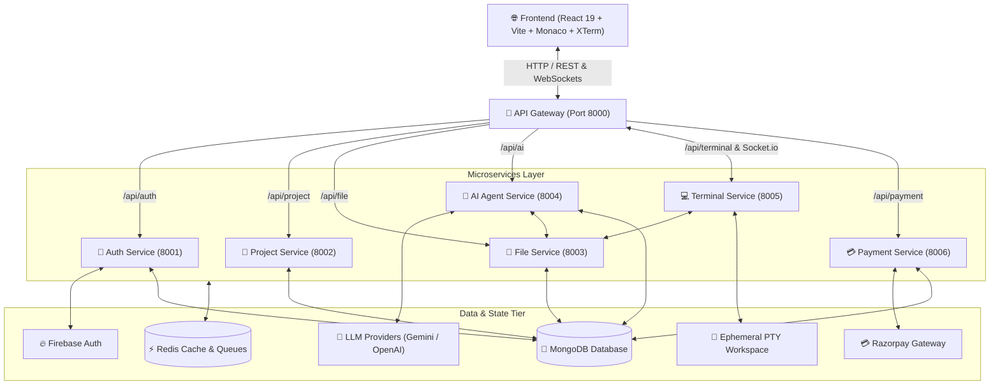

# ⚡ VertexAI — Next-Generation Cloud AI-Powered IDE

<div align="center">


[](https://react.dev/)
[](https://vitejs.dev/)
[](https://nodejs.org/)
[](https://expressjs.com/)
[](https://langchain-ai.github.io/langgraphjs/)
[](https://www.mongodb.com/)
[](https://redis.io/)
[](https://tailwindcss.com/)
[](https://firebase.google.com/)

<p align="center">
  <b>An autonomous, cloud-native AI development environment built on a high-throughput microservices architecture.</b><br>
  Scaffold, code, execute, and preview full-stack applications in real-time with an autonomous LLM coding agent, in-browser terminal, Monaco code editor, and sandboxed live preview.
</p>

[Key Features](#-key-features) • [System Architecture](#-system-architecture) • [Microservices Overview](#-microservices-overview) • [Tech Stack](#-tech-stack) • [Getting Started](#-getting-started) • [Environment Variables](#-environment-variables)

</div>

---

## 🌟 Overview

**VertexAI** is an intelligent web-based IDE (similar to Cursor and Bolt.new) engineered for rapid end-to-end software development. Rather than merely offering code completions or static chat assistance, VertexAI runs an autonomous **LangGraph-driven agent** equipped with direct filesystem manipulation tools to inspect project trees, create directories, scaffold multi-file projects, refactor components, and fix errors automatically.

Backed by a distributed Node.js microservices backend and an event-driven terminal streaming engine, developers get an ultra-fast, unified coding workspace inside their browser.

---

## ✨ Key Features

- 🤖 **Autonomous AI Coding Agent**: Powered by LangGraph and LangChain, capable of multi-step planning, file-tree inspection (`get_tree`), reading (`get_file`), and atomic file/directory writes (`create_file`, `update_file`, `create_folder`).
- 💻 **Professional Code Editor**: Monaco Editor integration featuring syntax highlighting, IntelliSense, auto-formatting, and multi-tab workspace management.
- ⚡ **Real-Time Interactive Terminal**: In-browser terminal powered by **XTerm.js**, **node-pty**, and bidirectional WebSocket streaming (`socket.io`), seamlessly syncing virtual filesystems to disk workspaces.
- 👁️ **Sandboxed Live Preview**: Instant hot-reloading preview frame for React + Vite and Vanilla HTML/CSS/JS applications.
- 📂 **Virtual Filesystem Hierarchy**: Distributed MongoDB-backed file storage with real-time directory tree construction and user-isolated workspaces.
- 🔐 **Secure Firebase Authentication**: Firebase OAuth & Token verification with user session sync across microservices.
- 💳 **Credit & Subscription Engine**: Integrated Razorpay payment workflow for quota top-ups, automated credit deduction per AI generation step, and usage analytics.
- 🚀 **High-Performance API Gateway**: Centralized reverse-proxy with request logging, cookie forwarding, route protection, and WebSocket upgrade multiplexing.

---

## 🏗️ System Architecture



---

## 🧩 Microservices Overview

| Service | Port | Description | Primary Dependencies |
| :--- | :--- | :--- | :--- |
| **API Gateway** | `8000` | Central ingress proxy, auth middleware, WebSocket routing | `express`, `http-proxy`, `morgan` |
| **Auth Service** | `8001` | User registration, session verification, user state sync | `firebase-admin`, `mongoose`, `jsonwebtoken` |
| **Project Service** | `8002` | Project scaffolding, metadata CRUD, project listing | `express`, `mongoose`, `dotenv` |
| **File Service** | `8003` | Virtual tree generation, file content CRUD, hierarchy management | `express`, `mongoose`, `buildTree` |
| **AI Service** | `8004` | LangGraph autonomous agent, tool bindings, credit deduction | `@langchain/langgraph`, `@langchain/core` |
| **Terminal Service** | `8005` | Real-time PTY spawn, WebSocket terminal streaming | `node-pty`, `socket.io`, `fs/promises` |
| **Payment Service** | `8006` | Razorpay order creation, signature verification, credit top-up | `razorpay`, `crypto`, `mongoose` |
| **Frontend** | `5173` | Interactive cloud IDE UI, Monaco, XTerm, Redux state | `react`, `vite`, `tailwindcss`, `motion` |

---

## 🛠️ Tech Stack

### **Frontend**
- **Framework**: React 19, Vite, React Router v7
- **Editor**: `@monaco-editor/react`
- **Terminal UI**: `@xterm/xterm`, `@xterm/addon-fit`
- **Styling & Animations**: Tailwind CSS v4, Motion (`motion`), `lucide-react`
- **State Management**: Redux Toolkit, React-Redux
- **Communication**: Axios, `socket.io-client`

### **Backend & AI**
- **Runtime**: Node.js (ES Modules)
- **Framework**: Express.js
- **Agent Orchestration**: LangGraph JS, LangChain Core
- **Terminal Engine**: `node-pty` (PowerShell on Windows / Bash on Linux)
- **Databases**: MongoDB (Mongoose ODM), Redis
- **Security & Payments**: Firebase Admin SDK, Razorpay SDK, JWT, CORS, Cookie-Parser

---

## 🚀 Getting Started

### 📋 Prerequisites
- **Node.js**: `v20.x` or higher
- **npm** or **pnpm**
- **MongoDB**: Local instance or MongoDB Atlas cluster
- **Redis**: Local server or Docker container
- **Firebase Account**: Service account key & web app config
- **Razorpay Account**: Key ID and Secret Key
- **AI Model Key**: Google Gemini / OpenAI / Groq API Key

---

### 📥 1. Clone the Repository

```bash
git clone https://github.com/buddherohit/vertexAI.git
cd vertexAI
```

---

### 🐳 2. Start Redis

Run Redis using Docker Compose:

```bash
cd backend
docker-compose up -d redis
cd ..
```

---

### 📦 3. Install Dependencies

Install dependencies across all services:

```bash
# Frontend
cd frontend
npm install
cd ..

# Backend Gateway & Services
cd backend/gateway && npm install && cd ../..
cd backend/services/auth && npm install && cd ../../..
cd backend/services/project && npm install && cd ../../..
cd backend/services/file && npm install && cd ../../..
cd backend/services/ai && npm install && cd ../../..
cd backend/services/terminal && npm install && cd ../../..
cd backend/services/payment && npm install && cd ../../..
```

---

### ⚙️ 4. Configure Environment Variables

Create `.env` files in each service directory based on the reference below.

#### **`backend/gateway/.env`**
```env
PORT=8000
FRONTEND_URL=http://localhost:5173
AUTH_SERVICE=http://localhost:8001
PROJECT_SERVICE=http://localhost:8002
FILE_SERVICE=http://localhost:8003
AI_SERVICE=http://localhost:8004
TERMINAL_SERVICE=http://localhost:8005
PAYMENT_SERVICE=http://localhost:8006
JWT_SECRET=your_jwt_secret_key
```

#### **`backend/services/auth/.env`**
```env
PORT=8001
MONGO_URI=mongodb://localhost:27017/vertex_auth
JWT_SECRET=your_jwt_secret_key
# Place serviceAccountKey.json inside backend/services/auth/
```

#### **`backend/services/project/.env`**
```env
PORT=8002
MONGO_URI=mongodb://localhost:27017/vertex_project
```

#### **`backend/services/file/.env`**
```env
PORT=8003
MONGO_URI=mongodb://localhost:27017/vertex_file
```

#### **`backend/services/ai/.env`**
```env
PORT=8004
MONGO_URI=mongodb://localhost:27017/vertex_ai
FILE_SERVICE_URL=http://localhost:8003
GEMINI_API_KEY=your_gemini_or_llm_key
```

#### **`backend/services/terminal/.env`**
```env
PORT=8005
FILE_SERVICE_URL=http://localhost:8003
MONGO_URI=mongodb://localhost:27017/vertex_terminal
```

#### **`backend/services/payment/.env`**
```env
PORT=8006
MONGO_URI=mongodb://localhost:27017/vertex_payment
RAZORPAY_KEY_ID=your_razorpay_key_id
RAZORPAY_KEY_SECRET=your_razorpay_key_secret
```

#### **`frontend/.env`**
```env
VITE_API_URL=http://localhost:8000
VITE_FIREBASE_API_KEY=your_firebase_key
VITE_FIREBASE_AUTH_DOMAIN=your_project.firebaseapp.com
VITE_FIREBASE_PROJECT_ID=your_project_id
VITE_FIREBASE_STORAGE_BUCKET=your_project.appspot.com
VITE_FIREBASE_MESSAGING_SENDER_ID=your_sender_id
VITE_FIREBASE_APP_ID=your_app_id
```

---

### ▶️ 5. Run the Application

Start each microservice in separate terminal tabs (or with a process manager like `pm2` / `concurrently`):

```bash
# Terminal 1 - Gateway
cd backend/gateway && npm run dev

# Terminal 2 - Auth Service
cd backend/services/auth && npm run dev

# Terminal 3 - Project Service
cd backend/services/project && npm run dev

# Terminal 4 - File Service
cd backend/services/file && npm run dev

# Terminal 5 - AI Service
cd backend/services/ai && npm run dev

# Terminal 6 - Terminal Service
cd backend/services/terminal && npm run dev

# Terminal 7 - Payment Service
cd backend/services/payment && npm run dev

# Terminal 8 - Frontend Client
cd frontend && npm run dev
```

Visit **`http://localhost:5173`** in your browser.

---

## 📂 Repository Structure

```
vertexAI/
├── backend/
│   ├── docker-compose.yml           # Redis container orchestration
│   ├── gateway/                     # Ingress Reverse Proxy & WS Upgrade
│   ├── services/
│   │   ├── ai/                      # LangGraph Coding Agent & Toolset
│   │   ├── auth/                    # Firebase Auth & User Persistence
│   │   ├── file/                    # Virtual Filesystem & Hierarchy Tree
│   │   ├── payment/                 # Razorpay Gateway & Credit Balances
│   │   ├── project/                 # Workspace Metadata & CRUD
│   │   └── terminal/                # Node-pty Shell & Socket.IO Handler
│   └── shared/                      # Shared Redis client & utilities
├── frontend/
│   ├── src/
│   │   ├── components/              # Monaco Editor, XTerm Terminal, Preview, Explorer
│   │   ├── features/                # Async Redux Thunks & API Bindings
│   │   ├── pages/                   # Dashboard, Project Workspace, Plans
│   │   ├── redux/                   # Slices & Global State Store
│   │   └── utils/                   # Axios interceptors & Icon helpers
│   ├── index.html
│   └── vite.config.js
├── .gitignore
└── README.md
```

---

## 🛡️ Security & Best Practices

- **Zero Secret Exposure**: `.env` configurations and cloud service account credentials (`serviceAccountKey.json`) are excluded from version control.
- **Isolated User Workspaces**: Filesystem calls and terminal execution sessions are isolated by `userId` and `projectId`.
- **Protected Endpoints**: Gateway enforces token validation on internal microservice proxies via custom proxy headers (`x-user-id`).

---

## 🤝 Contributing

Contributions are welcome! If you'd like to improve VertexAI:

1. **Fork** the repository
2. **Create** your feature branch (`git checkout -b feature/amazing-feature`)
3. **Commit** your changes (`git commit -m 'feat: add amazing feature'`)
4. **Push** to the branch (`git push origin feature/amazing-feature`)
5. **Open** a Pull Request

---

## 📄 License

This project is licensed under the [MIT License](LICENSE).

---

<div align="center">
  <sub>Built with ❤️ by <a href="https://github.com/buddherohit">Rohit Buddhe</a></sub>
</div>
